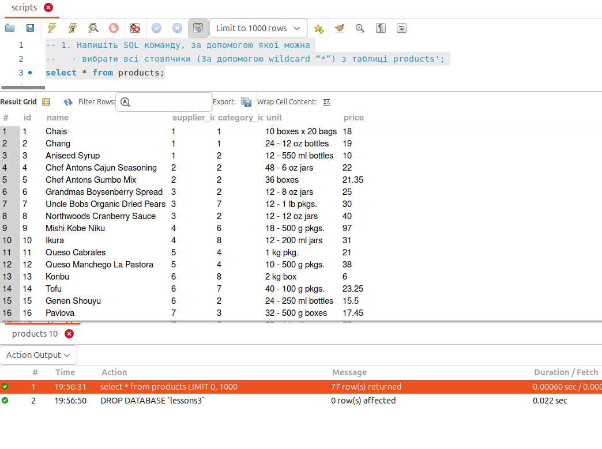
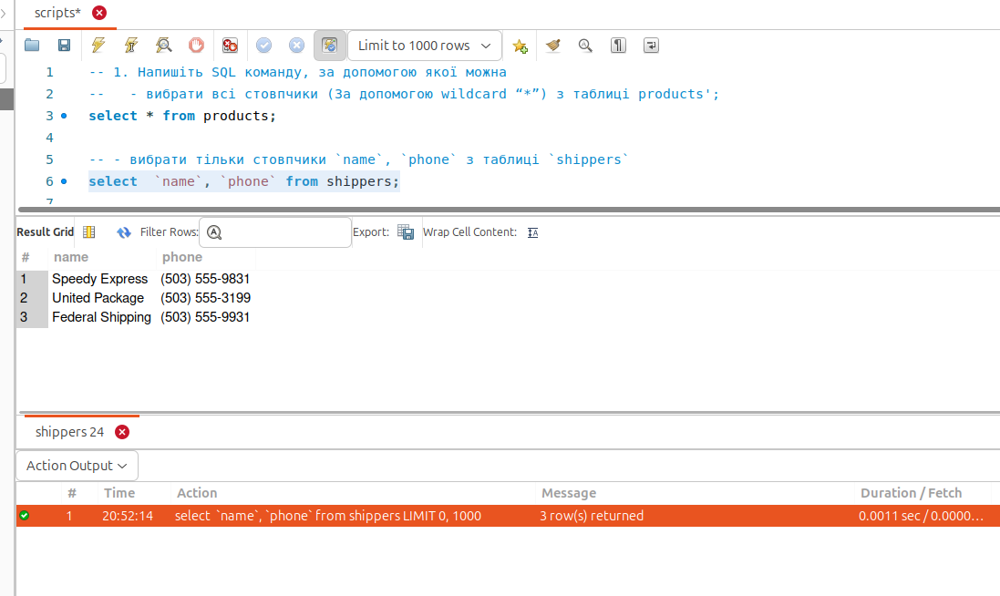
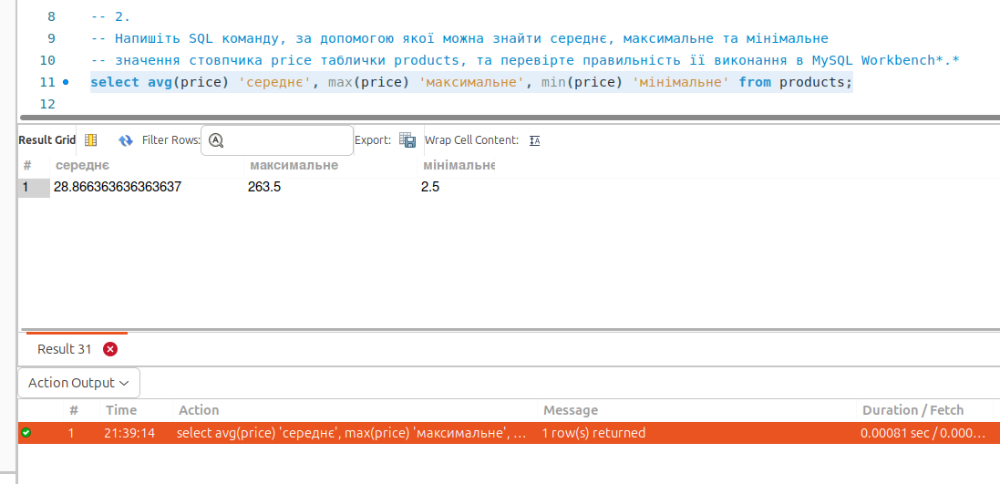
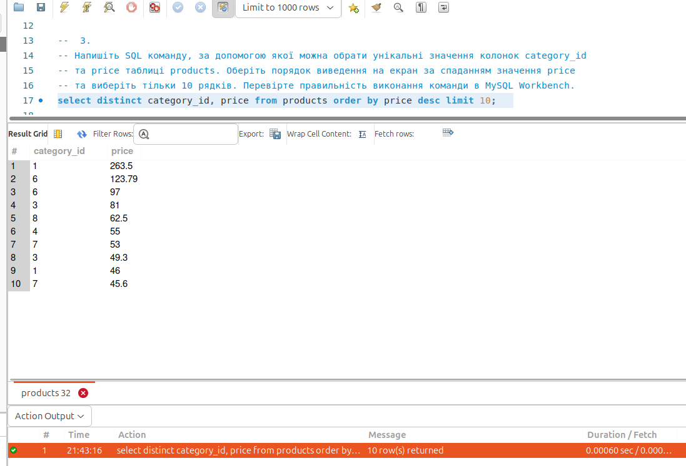
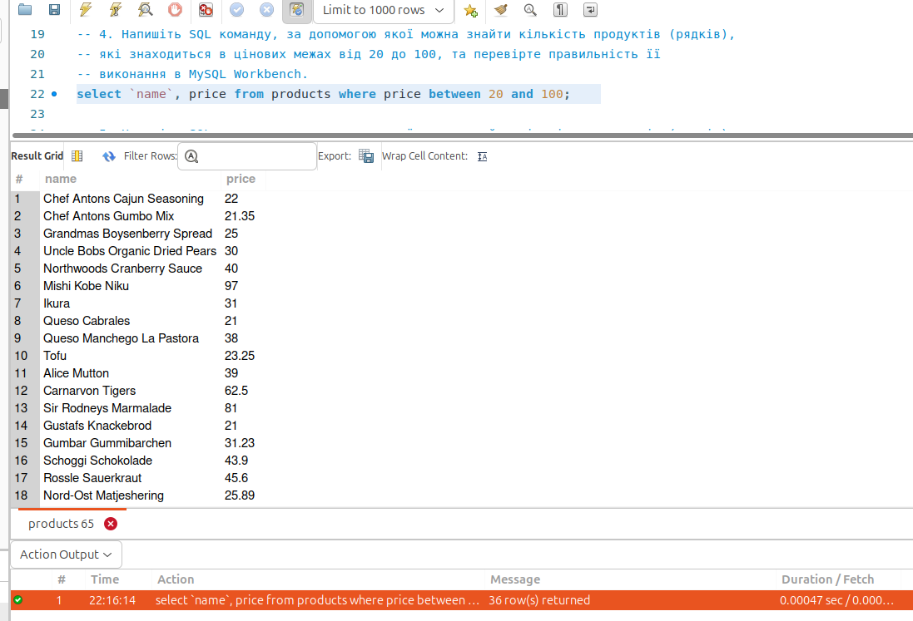
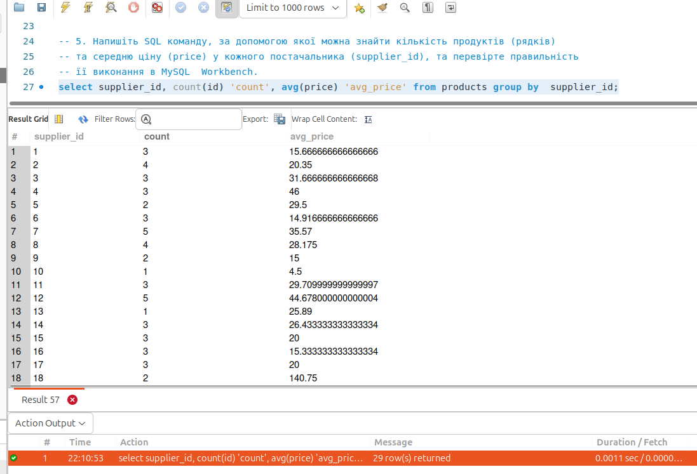

# Завантаження даних та основи SQL. DQL команди

1. Напишіть `SQL` команду, за допомогою якої можна:

   - вибрати всі стовпчики (За допомогою `wildcard “\*”`) з таблиці `products`;

   

   - вибрати тільки стовпчики `name`, `phone` з таблиці `shippers`,
     та перевірте правильність її виконання в `MySQL Workbench`.

   

2. Напишіть `SQL` команду, за допомогою якої можна знайти середнє, максимальне та мінімальне значення стовпчика price таблички products, та перевірте правильність її виконання в `MySQL Workbench` `*.*`

   

3. Напишіть `SQL` команду, за допомогою якої можна обрати унікальні значення колонок `category_id` та `price` таблиці `products`.Оберіть порядок виведення на екран за спаданням значення `price` та виберіть тільки 10 рядків. Перевірте правильність виконання команди в `MySQL Workbench`.

   

4. Напишіть `SQL` команду, за допомогою якої можна знайти кількість продуктів (рядків), які знаходиться в цінових межах від 20 до 100, та перевірте правильність її виконання в `MySQL Workbench`.

   

5. Напишіть `SQL` команду, за допомогою якої можна знайти кількість продуктів (рядків) та середню ціну (`price`) у кожного постачальника (`supplier_id`), та перевірте правильність її виконання в `MySQL Workbench`.

   
